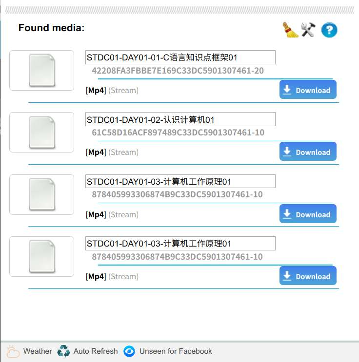

# 网页视频下载器（谷歌浏览器插件）
这个视频下载器很强大，自带ffmpeg可以自动解析加密的m3u8视频流并将其合并成mp4文件，原插件名为Stream Video Downloader.crx，看注释似乎是个俄国人写的
# 本人修改的地方
1. 添加下载队列功能，默认最大下载数为2，解决同时下载多个视频时的并发问题，最大下载数在Load.js第9行修改：
```
var maxDownloadNum=2;//最大同时下载数
```
2. 可以修改文件名，在popup弹出网页里添加输入框，可以自定义保存文件名，配合chrome的自动保存，可以实现下载后不用管（达内的视频文件可以自动判断输入）


3. 在自定义文件输入框下显示真实文件名，方便判断